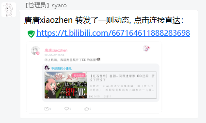
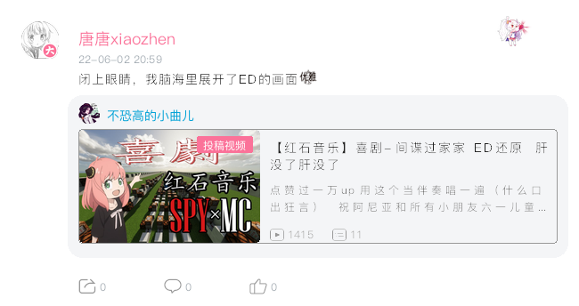
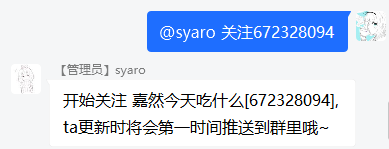
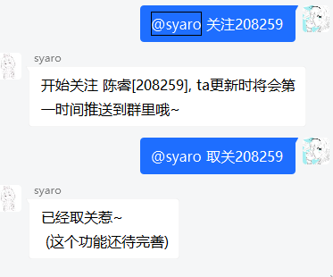
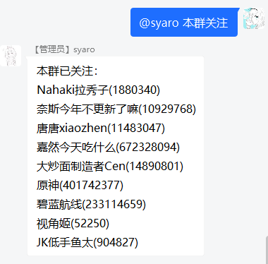
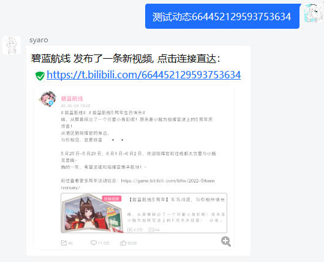
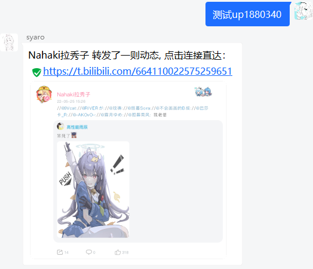

# bili动态监视器(Hoshino插件)

)

## Desc 简介

用于视奸指定up主，并将其最新的动态信息推送到申请的群里。

<figure class="half">
    
    
</figure>

## 功能：

> - 获取UP主最新的动态，生成图片发送到群里
> - 在群中关联up主，可以推送包括动态、视频、短视频、专栏文章、~~音频、~~相簿在内的绝大多数动态信息（不支持直播）。
> - 支持过滤转发的互动抽奖动态、广告（简单粗暴的关键词过滤），可以由**机器人管理员**控制。
> - ~~机器人管理员和群主、群管理可以直接增加视奸的up主，普通群员的申请信息会私发到机器人管理员处进行处理。~~（还没做，仅群管理可以关注和取关）
> - 协议、业务分离设计，方便不同机器人移植！ 接口文档即将更新~~

## 部署

1. 进入到Hoshino的modules目录，克隆项目

`git clone https://github.com/kushidou/bili-notice-hoshino.git`

2. 安装几个python包（也可以手动pip安装）

`pip install -r ./requirements.txt `

> ***PS.***
> 
> 在Windows平台使用时，通常会报告`no library called "cairo" was found` 的错误，需要按照 [#8]() 的方案处理一下。
>
> 参考连接：
>
> [win10 安装 cairosvg](https://www.jianshu.com/p/5f566c26334f)
>
> [GTK-for-Windows](https://github.com/tschoonj/GTK-for-Windows-Runtime-Environment-Installer)

3. 将uppers_example重命名为 uppers   (uppers目录下 `list.json`为空时，至少要保证里面是`{}`)

> ***PS.***
> 由于插件的编写环境为Linux，当运行在Windows平台，自带的配置文件可能出现编码兼容性问题。可以创建一个新的文件夹并命名`uppers`，然后创建一个新的`list.json`文件，内容为空的json结构: `{}`

4. 在`config/__bot__.py`的`MODULES_ON`中，添加`"bili-notice-hoshino"`，然后重启HoshinoBot。

5. enjoy

  
插件内文件说明

> **bili_notice_hoshino.py** ==>  主程序
>
> **res** ==>  目录保存渲染所需要的图片文件和字体;以及缓存图片，以md5命名
>
> **uppers/uid.json** ==>  保存各个up主的已发送动态列表(防止程序调试等情况反复重发)
>
> **uppers/list.json** ==>  记录up主和群的对应关系，及几个配置。
>
> **log/xxx.log** ==>  日志，按日分类，最长七天。仍在测试中，暂不支持修改。

## 使用

### 1-关注

启用插件后，群内发送  `关注672328094`  并@机器人即可关注 _嘉然今天吃什么_，嘉然更新的动态都会发过来哦~

### 2-取关

群内发送  `取关208259`   并@机器人即可取关叔叔， 请注意，只有所有群都取关叔叔后，动态更新轮询才会跳过叔叔哦！

### 3-查看已关注

群内发送 `看看成分`、`本群关注` 并@机器人，即可获得当前群的关注列表。

机器人管理员发送`所有关注`、`所有群关注`可以获得所有所有群关注列表的详细信息

### 4-debug

由于插件刚刚推出beta版，不仅功能没做完，还有很多隐形bug，因此 `bili_notice_test.py` 提供了一个debug的方法，该方法只能机器人的管理员使用。

发送"测试动态\[dynamic_id\]"或者"测试up\[uid\]"即可让机器人立即尝试发送一条动态，来查看问题出在哪里。报告问题时也请提供该方法得到的错误日志。

<figure class="half">
    
    
</figure>

### 5-机器人管理指令

支持机器人管理员调整bili动态监视器的全局配置，比如是否过滤转发抽奖、是否进行关键词屏蔽等。比如：

`bili-ctl black-words 23947287 add 拼多多 pdd`

|功能|指令|参数1|参数2-n|备注
|---|-----|-------|---------|---|
|过滤抽奖|islucky|uid|true\|false|是否屏蔽抽奖开奖动态或者转发的抽奖。|
|关键词过滤|black-words|uid|add 关键词1 关键词2|add 增加关键词，remove移除，list列出已经设置的关键词|
|更新信息|update| - | - |立即读取配置文件，更新配置（不检查合法性，可能引发错误）

## 后记

历时将近3个礼拜的摸鱼，终于把这个插件开发出了一个模样，虽然各种功能都不算完善。之所以选择HoshinoBot作为机器人的基础平台，主要还是它的功能封装的好用，对于我一个自学python的初学者来说是最方便的。我之前也开发了一些十几行的小插件，比如复读功能改成随机复读、群员消息防撤回等。

我在朋友的群里见到过类似的发送动态图片的机器人，找他要来源码后，发现是基于Nonebot2的，而且是使用一个chromium浏览器内核直接生成网页，然后对动态部分截图来实现的。不想在服务器上跑浏览器，所以萌生了让python直接解析动态的json串来生成动态图片的想法。

由于样本少，如果遇到一些奇奇怪怪的动态时，会无法分享动态。如果你遇到的这种情况，欢迎在issue里提交这条动态的id！（尤其是类似番剧分享、发布，H5活动页分享等）

#### 鸣谢

[Ice-Cirno/HoshinoBot](https://github.com/Ice-Cirno/HoshinoBot)

[SocialSisterYi/bilibili-API-collect](https://github.com/SocialSisterYi/bilibili-API-collect)

#### ToDo

- [x] 完善对专栏文章、小视频的支持

- [x] 慢慢完善对番剧、影视剧集等一般人不会发的类型的支持

- [x] 支持自定义过滤词，比如“运营代转”

- [ ] 优化文字绘制，更清晰锐利

- [ ] 支持直播开播推送，支持手动拉取特定的多条动态

- [ ] 修复即将遇到的各种奇奇怪怪的BUG

- [ ] UP主信息换用数据库存储，提高容量(咕咕咕~等我先学一下数据库的基础)

- [x] 提供移植指南，开发适用于其他bot或者nonebot1、nonebot2的插件版本

