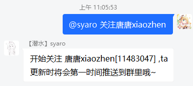

# bili动态监视器(Hoshino插件)

)

## Desc 简介

用于视奸指定up主，并将其最新的动态信息推送到申请的群里。

<table rules="none" align="center">
	<tr>
		<td>
			

				
				 
				群消息
			

		</td>
		<td>
			

				
				 
				生成的卡片
			

		</td>
	</tr>
</table>

## 功能：

> - 获取UP主最新的动态，生成图片发送到群里
> - 在群中关联up主，可以推送包括动态、视频、短视频、专栏文章、音频、相簿在内的绝大多数动态信息（暂不支持直播）。
> - 支持过滤转发的互动抽奖动态、广告（简单粗暴的关键词过滤），可以由**机器人管理员**控制。
> - ~~机器人管理员和群主、群管理可以直接增加视奸的up主，普通群员的申请信息会私发到机器人管理员处进行处理。~~（还没做，仅群管理可以关注和取关）
> - 协议、业务分离设计，方便不同机器人平台进行移植 [接口文档](./api.md)

## 部署

详细的部署步骤，及Windows平台部署的注意事项，请访问本项目[Wiki页📕](https://github.com/kushidou/bili-notice-hoshino/wiki/%E9%83%A8%E7%BD%B2%E6%8F%92%E4%BB%B6)

1. 进入到Hoshino的modules目录，克隆项目

`git clone https://github.com/kushidou/bili-notice-hoshino.git`

2. 安装依赖的包

`pip install -r ./requirements.txt `

3. 将'uppers_example'重命名为 uppers， 将'config_example.ini`重命名为 config.ini

  
config配置方法

<a herf="https://github.com/kushidou/bili-notice-hoshino/wiki/config%E9%85%8D%E7%BD%AE">config配置-wiki</a>

4. 在`config/__bot__.py`的`MODULES_ON`中，添加`"bili-notice-hoshino"`，然后重启HoshinoBot。

5. enjoy

## 使用

### 1-关注

启用插件后，群内发送  `关注uid/昵称`  并@机器人即可关注 _[@嘉然今天吃什么](https://space.bilibili.com/672328094)_，嘉然更新的动态都会发过来哦~

> ** 2022-07-28重要更新：**
> 现在支持使用昵称关注。如果昵称和现有UP主的名字、短昵称、或者B站搜索页结果完全匹配则直接关注。若无法完全匹配，那么会询问是否要关注，终于不用再去复制UID了！！🎆🎇🎆🎇🎆
> 

### 2-取关

群内发送  `取关208259`   并@机器人即可取关叔叔。同样可以通过直接输入名字、短昵称来关注

### 3-查看已关注

群内发送 `看看成分`、`本群关注` 并@机器人，即可获得当前群的关注列表。

机器人管理员直接发送`所有关注`、`所有群关注`可以获得所有所有群关注列表的详细信息

### 4-机器人管理指令

支持机器人管理员调整bili动态监视器的全局配置，比如是否过滤转发抽奖、是否进行关键词屏蔽等。比如：

`bili-ctl black-words 23947287 add 拼多多 pdd`

|功能|指令|参数1|参数2-n|备注
|---|-----|-------|---------|---|
|过滤抽奖|islucky|uid|true\|false|是否屏蔽抽奖开奖动态或者转发的抽奖。|
|关键词过滤|black-words|uid|add 关键词1 关键词2|add 增加关键词，remove移除，list列出已经设置的关键词|
|重载信息|reload| - | - |立即读取up记录，用于手动更新配置文件（不检查合法性，可能引发错误）|
|昵称操作|add-nick/ del-nick/ list-nick| uid | nick(一次一个，list不要) | 为特定对象添加、删除、查看特定用户短昵称|

## 后记

*2022-05-26*

历时将近3个礼拜的摸鱼，终于把这个插件开发出了一个模样，虽然各种功能都不算完善。之所以选择HoshinoBot作为机器人的基础平台，主要还是它的功能封装的好用，对于我一个自学python的初学者来说是最方便的。我之前也开发了一些十几行的小插件，比如复读功能改成随机复读、群员消息防撤回等。

我在朋友的群里见到过类似的发送动态图片的机器人，找他要来源码后，发现是基于Nonebot2的，而且是使用一个chromium浏览器内核直接生成网页，然后对动态部分截图来实现的。不想在服务器上跑浏览器，所以萌生了让python直接解析动态的json串来生成动态图片的想法。

由于样本少，如果遇到一些奇奇怪怪的动态时，会无法分享动态。如果你遇到的这种情况，欢迎在issue里提交这条动态的id！（尤其是类似番剧分享、发布，H5活动页分享等）

*2022-07-28*

从插件push到Github已经两个月了，这期间增加了很多新功能，也修了不少bug。最近修改的频率变低了，主要是正经工作忙了起来，导致周末更不想改代码了。

在今天把昵称操作的代码上线后，最近会降低更新频率，只进行紧急bug修复，新功能的开发、动态类型的补足都会一定程度延后，希大家谅解。

最后我想给插件设计一个logo、slogan或者“看板娘”，并且做成视频放到b站上进行推广，如果大家有什么好的创意，或者牵线搭桥、提供建议的，都可以联系我，感谢~

a
    
联系方式

> 1. 邮箱 small09@qq.com
> 
> 2. QQ群 655742099
> 
> 3. B站私信 唐唐xiaozhen
>

### 鸣谢

[Ice-Cirno/HoshinoBot](https://github.com/Ice-Cirno/HoshinoBot)

[SocialSisterYi/bilibili-API-collect](https://github.com/SocialSisterYi/bilibili-API-collect)

